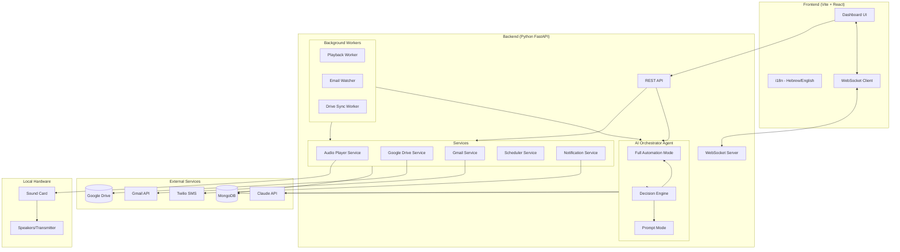
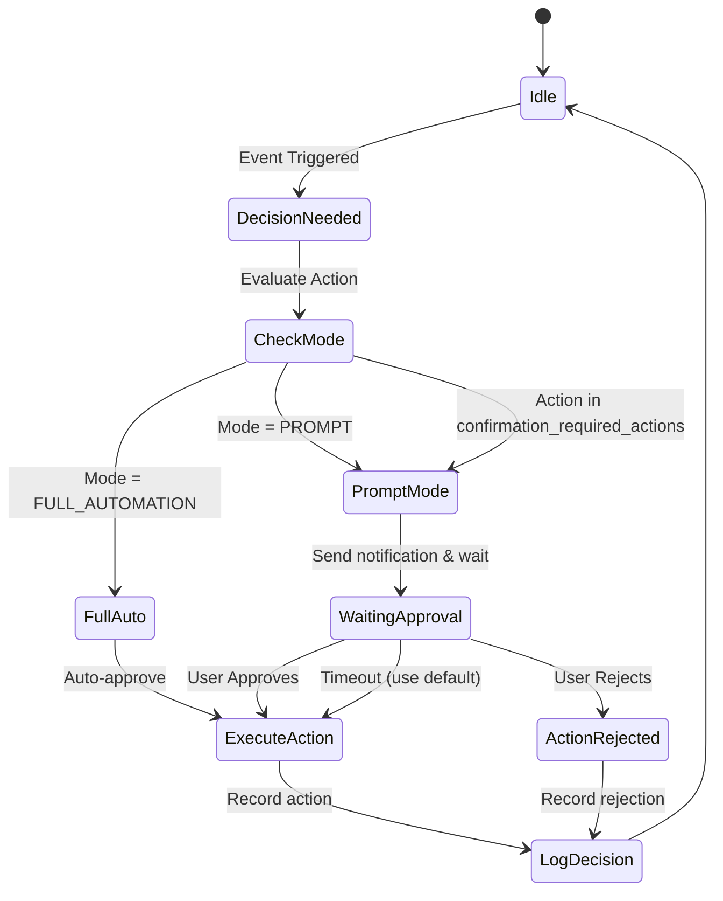
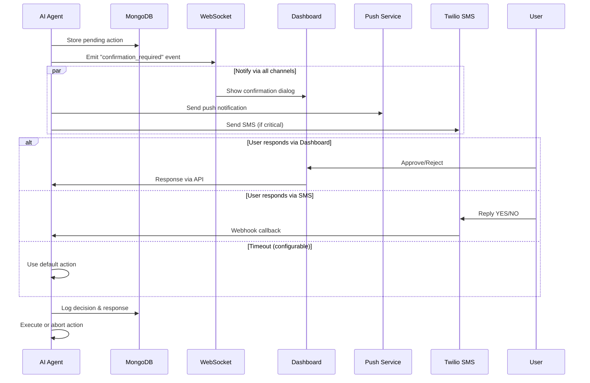
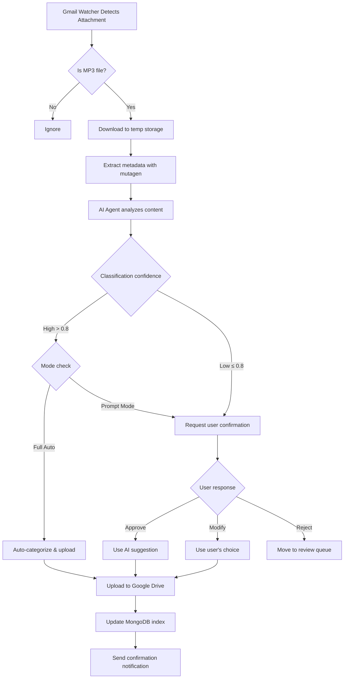
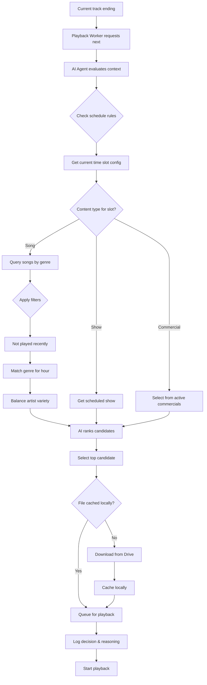

# Israeli Radio Manager - Project Plan

## Overview
A management dashboard and platform for an Israeli Hebrew-speaking radio station broadcasting in the Miami/Boca Raton/Keys area. The system manages three content types (songs, shows, commercials) with AI-powered orchestration that can run fully autonomously or with user confirmations.

---

## System Architecture



---

## AI Orchestrator Agent - Detailed Design

### Agent Operation Modes



### Mode 1: Full Automation Mode (No Human Intervention)

The agent operates completely autonomously, making all decisions without requiring user input.

**Capabilities in Full Automation:**
- Select next track based on schedule rules, genre preferences, and play history
- Insert commercials at configured intervals
- Start/stop scheduled shows automatically
- Process incoming email attachments and auto-categorize
- Upload and organize new content to Google Drive
- Handle playback errors with fallback content
- Send notification summaries (not asking for permission)
- Rebalance playlists to avoid repetition
- Manage dead air prevention

**Configuration:**
```python
{
    "mode": "full_automation",
    "fallback_on_error": True,
    "dead_air_prevention": True,
    "max_song_repeat_hours": 4,
    "commercial_interval_minutes": 15,
    "auto_categorize_confidence_threshold": 0.8,
    "notification_level": "summary_only"  # Only sends daily summaries
}
```

### Mode 2: Prompt Mode (User Confirmation Required)

The agent pauses on certain actions and requests user confirmation via push notification, SMS, or dashboard alert.

**Actions Requiring Confirmation (Configurable):**

| Action | Default | Notification Method |
|--------|---------|---------------------|
| Categorize new content | ✅ Requires | Push + Dashboard |
| Delete content | ✅ Requires | Push + SMS |
| Override scheduled show | ✅ Requires | Push + SMS |
| Change genre mid-hour | ❌ Auto | - |
| Insert emergency commercial | ❌ Auto | - |
| Skip problematic track | ❌ Auto | - |
| Modify schedule rules | ✅ Requires | Push + SMS |
| Process email attachment | ✅ Requires | Push |

**Confirmation Flow:**



**Timeout Behavior:**
- Default timeout: 5 minutes (configurable per action type)
- On timeout: Execute default action (configurable: approve/reject/skip)
- Critical actions (delete, schedule override): Default to reject on timeout

---

## Content Flow Diagrams

### Email Attachment Processing



### Playback Decision Flow



---

## Tech Stack

| Component | Technology |
|-----------|------------|
| Frontend | Vite + React + TypeScript |
| Backend | Python 3.11+ / FastAPI |
| Database | MongoDB |
| AI Agent | Claude API (Anthropic) |
| Audio Playback | python-vlc |
| Storage | Google Drive API |
| Email | Gmail API |
| Notifications | Gmail (email), Web Push API, Twilio (SMS) |
| Task Queue | APScheduler / Celery (optional) |
| WebSocket | FastAPI WebSocket |
| Deployment | Local server (Docker optional) |

---

## Project Structure

```
israeli-radio-manager/
├── backend/
│   ├── app/
│   │   ├── __init__.py
│   │   ├── main.py
│   │   ├── config.py
│   │   ├── models/
│   │   │   ├── content.py
│   │   │   ├── schedule.py
│   │   │   ├── agent.py           # Agent config & pending actions
│   │   │   └── notifications.py
│   │   ├── routers/
│   │   │   ├── content.py
│   │   │   ├── schedule.py
│   │   │   ├── playback.py
│   │   │   ├── upload.py
│   │   │   ├── agent.py           # Agent control & confirmations
│   │   │   └── websocket.py
│   │   ├── services/
│   │   │   ├── google_drive.py
│   │   │   ├── gmail.py
│   │   │   ├── audio_player.py
│   │   │   ├── scheduler.py
│   │   │   └── notifications.py
│   │   ├── agent/
│   │   │   ├── __init__.py
│   │   │   ├── orchestrator.py    # Main AI agent logic
│   │   │   ├── modes.py           # Full auto & prompt mode handlers
│   │   │   ├── decisions.py       # Decision types & handlers
│   │   │   ├── prompts.py         # Claude prompt templates
│   │   │   └── confirmation.py    # Confirmation flow manager
│   │   ├── workers/
│   │   │   ├── playback.py
│   │   │   ├── email_watcher.py
│   │   │   └── drive_sync.py
│   │   └── utils/
│   │       ├── audio_metadata.py
│   │       └── file_organizer.py
│   ├── requirements.txt
│   └── .env.example
├── frontend/
│   ├── src/
│   │   ├── main.tsx
│   │   ├── App.tsx
│   │   ├── i18n/
│   │   │   ├── en.json
│   │   │   └── he.json
│   │   ├── components/
│   │   │   ├── Layout/
│   │   │   ├── Player/
│   │   │   ├── Schedule/
│   │   │   ├── Library/
│   │   │   ├── Agent/
│   │   │   │   ├── ModeToggle.tsx
│   │   │   │   ├── ConfirmationDialog.tsx
│   │   │   │   ├── DecisionLog.tsx
│   │   │   │   └── ActionQueue.tsx
│   │   │   └── Notifications/
│   │   ├── pages/
│   │   │   ├── Dashboard.tsx
│   │   │   ├── Schedule.tsx
│   │   │   ├── Library.tsx
│   │   │   ├── Upload.tsx
│   │   │   ├── AgentControl.tsx   # AI agent management
│   │   │   └── Settings.tsx
│   │   ├── hooks/
│   │   │   ├── useWebSocket.ts
│   │   │   └── useAgent.ts
│   │   ├── services/
│   │   │   └── api.ts
│   │   └── store/
│   │       ├── playerStore.ts
│   │       ├── agentStore.ts
│   │       └── notificationStore.ts
│   ├── vite.config.ts
│   └── package.json
├── docker-compose.yml
├── .gitignore
└── README.md
```

---

## Data Models

### Agent Configuration
```python
{
    "_id": ObjectId,
    "mode": "full_automation" | "prompt",
    "confirmation_required_actions": [
        "categorize_content",
        "delete_content",
        "override_schedule",
        "modify_rules"
    ],
    "timeouts": {
        "default": 300,           # 5 minutes
        "critical": 600,          # 10 minutes
        "categorize": 1800        # 30 minutes
    },
    "timeout_defaults": {
        "categorize_content": "approve",
        "delete_content": "reject",
        "override_schedule": "reject"
    },
    "automation_rules": {
        "dead_air_prevention": True,
        "max_song_repeat_hours": 4,
        "commercial_interval_minutes": 15,
        "auto_categorize_threshold": 0.8
    }
}
```

### Pending Action (for Prompt Mode)
```python
{
    "_id": ObjectId,
    "action_type": str,
    "description": str,
    "description_he": str,          # Hebrew description
    "ai_reasoning": str,
    "suggested_action": dict,
    "alternatives": [dict],
    "created_at": datetime,
    "expires_at": datetime,
    "status": "pending" | "approved" | "rejected" | "timeout",
    "responded_by": "user" | "timeout" | None,
    "response_channel": "dashboard" | "sms" | "push" | None,
    "final_action": dict | None
}
```

### Content Model
```python
{
    "_id": ObjectId,
    "type": "song" | "show" | "commercial",
    "title": str,
    "title_he": str | None,
    "artist": str | None,
    "genre": str | None,
    "duration_seconds": int,
    "google_drive_id": str,
    "google_drive_path": str,
    "local_cache_path": str | None,
    "metadata": {
        "language": "hebrew",
        "year": int | None,
        "tags": [str],
        "ai_classification": {
            "confidence": float,
            "suggested_type": str,
            "suggested_genre": str
        }
    },
    "created_at": datetime,
    "last_played": datetime | None,
    "play_count": int,
    "active": bool
}
```

---

## Implementation Phases

### Phase 1: Project Setup
- [x] Create project plan
- [ ] Initialize git repository
- [ ] Create directory structure
- [ ] Set up Python backend (FastAPI + dependencies)
- [ ] Set up React frontend (Vite + dependencies)
- [ ] Configure MongoDB connection
- [ ] Create environment variable templates

### Phase 2: Core Backend
- [ ] Audio Player Service (python-vlc)
- [ ] Google Drive Service (OAuth + file operations)
- [ ] Scheduler Service (time slots, rules)
- [ ] Basic REST API endpoints

### Phase 3: AI Agent Core
- [ ] Claude API integration
- [ ] Decision engine implementation
- [ ] Full Automation mode
- [ ] Prompt mode with confirmation flow
- [ ] WebSocket for real-time updates

### Phase 4: Content Management
- [ ] Content CRUD API
- [ ] Gmail watcher for attachments
- [ ] Auto-categorization with AI
- [ ] Google Drive sync

### Phase 5: Frontend
- [ ] i18n setup (Hebrew RTL + English)
- [ ] Dashboard with now playing
- [ ] Schedule management UI
- [ ] Content library browser
- [ ] Agent control panel
- [ ] Confirmation dialogs

### Phase 6: Notifications & Polish
- [ ] Email notifications
- [ ] Push notifications
- [ ] SMS via Twilio
- [ ] Error handling & fallbacks

---

## Key Files to Create

1. `/backend/app/main.py` - FastAPI entry
2. `/backend/app/agent/orchestrator.py` - AI agent core
3. `/backend/app/agent/modes.py` - Automation/Prompt modes
4. `/backend/app/services/audio_player.py` - VLC integration
5. `/backend/app/services/google_drive.py` - Drive API
6. `/frontend/src/pages/AgentControl.tsx` - Agent UI
7. `/frontend/src/i18n/he.json` - Hebrew translations
